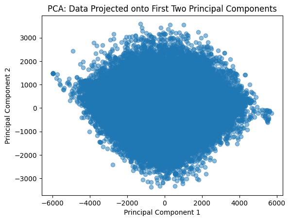
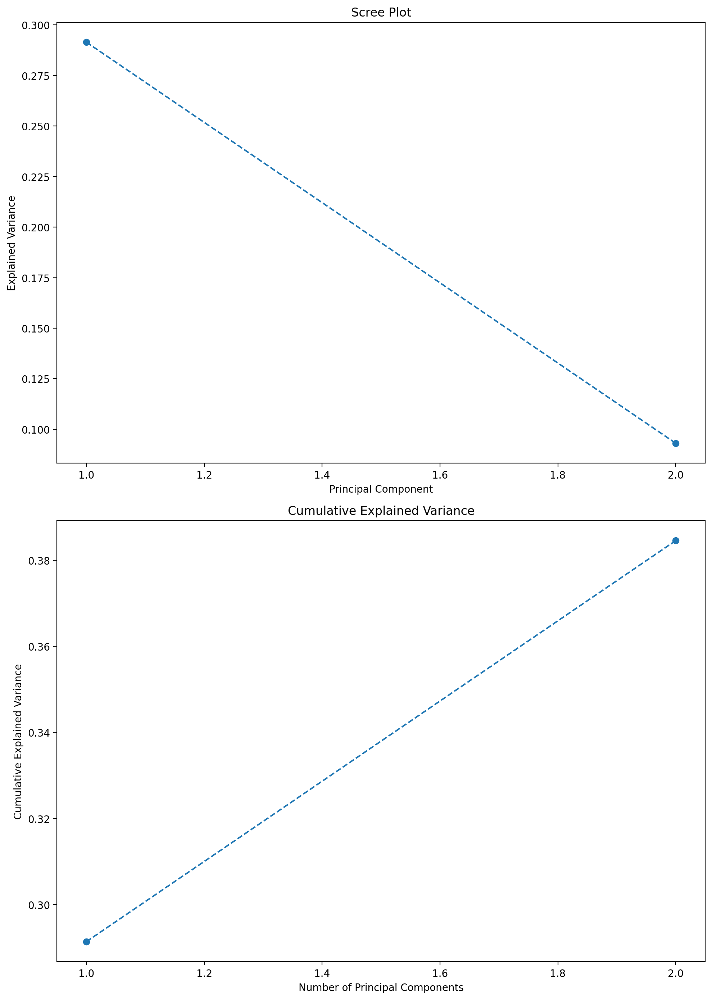
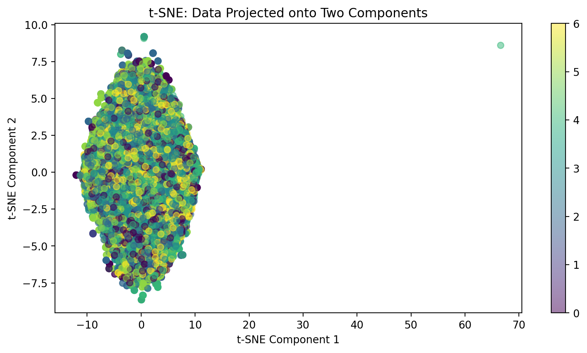
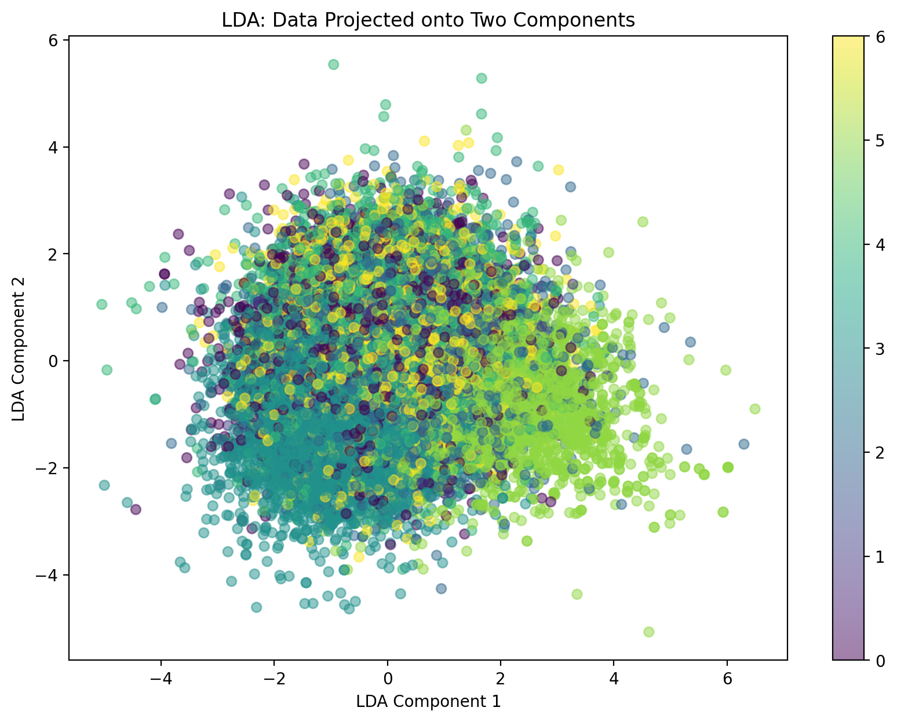

# Mini-Project for Fundamentals of Machine Learning Course

This repository contains the code and data for a mini-project on facial expression recognition using machine learning algorithms.

## 📑 Project Policy
- Team: group should consist of 3-4 students.

    |No.| Student Name    | Student ID |
    | --------| -------- | ------- |
    |1|Mai Chiến Vĩ Thiên|21280049|
    |2|Nguyễn Đỗ Nhã Trúc|21280053|


- The submission deadline is strict: **11:59 PM** on **June 22nd, 2024**. Commits pushed after this deadline will not be considered.

## 📦 Project Structure

The repository is organized into the following directories:

- **/data**: This directory contains the facial expression dataset. You'll need to download the dataset and place it here before running the notebooks. (Download link provided below)
- **/notebooks**: This directory contains the Jupyter notebook ```EDA.ipynb```. This notebook guides you through exploratory data analysis (EDA) and classification tasks.

## ⚙️ Usage

This project is designed to be completed in the following steps:

1. **Fork the Project**: Click on the ```Fork``` button on the top right corner of this repository, this will create a copy of the repository in your own GitHub account. Complete the table at the top by entering your team member names.

2. **Download the Dataset**: Download the facial expression dataset from the following [link](https://mega.nz/file/foM2wDaa#GPGyspdUB2WV-fATL-ZvYj3i4FqgbVKyct413gxg3rE) and place it in the **/data** directory:

3. **Complete the Tasks**: Open the ```notebooks/EDA.ipynb``` notebook in your Jupyter Notebook environment. The notebook is designed to guide you through various tasks, including:
    
    1. Prerequisite
    2. Principle Component Analysis
    3. Image Classification
    4. Evaluating Classification Performance 

    Make sure to run all the code cells in the ```EDA.ipynb``` notebook and ensure they produce output before committing and pushing your changes.

5. **Commit and Push Your Changes**: Once you've completed the tasks outlined in the notebook, commit your changes to your local repository and push them to your forked repository on GitHub.


Feel free to modify and extend the notebook to explore further aspects of the data and experiment with different algorithms. Good luck.

# **Comprehensive Analysis of PCA and its Application in Facial Expression Recognition**
# **Team Report and Interesting Findings**

## **I. Theoretical Foundations of PCA**

Principal Component Analysis (PCA) is a statistical technique used to identify patterns in data by transforming it into a set of orthogonal (uncorrelated) components, ordered by the amount of variance they capture. The primary objectives of PCA are to reduce the dimensionality of the data while retaining most of the variability and to identify the directions (principal components) along which the data varies the most.

### ***Mathematical Formulation***
Given a dataset $X$ with $n$ samples and $p$ features, PCA involves the following steps:

1. Standardization
    - Center the data by subtracting the mean of each feature.
    - Optionally, scale the data to unit variance.

2. Covariance Matrix Calculation
    - Compute the covariance matrix $C$:
    $$ C = \frac{1}{n-1} X^T X $$

3. Eigenvalue Decomposition
    - Compute the eigenvalues and eigenvectors of the covariance matrix. The eigenvectors represent the principal components, and the eigenvalues indicate the amount of variance captured by each principal component.

4. Projection
    - Project the data onto the principal components to obtain the transformed dataset.


## **II. Practical Implementation of PCA**

### ***Preprocessing Steps***
Before applying PCA, the dataset is preprocessed to ensure the data is suitable for analysis. This includes:

1. Loading the Dataset:
- Importing the FER2013 dataset and separating the features (pixel values) from the labels (emotion categories).

2. Standardization:
- Standardizing the features to have zero mean and unit variance using a StandardScaler.

3. PCA Transformation:
- Applying PCA to the standardized data to reduce its dimensionality to two principal components for visualization.

### ***Applying and Visualization***



### ***Observations***
- Data Spread:
    - The data points are widely spread across both principal components, indicating a significant variance captured by the first two principal components.
    - The range of the principal components spans from approximately -6000 to 6000 for both PC1 and PC2.

- Density of Points:
    - The central region of the plot is densely populated, suggesting that a large number of images have similar principal component values, implying similarities in the features extracted by PCA.

- Outliers:
    - There are several points scattered away from the dense central cluster, indicating the presence of outliers or unique samples with distinct features.

- Symmetry:
    - The distribution appears somewhat symmetrical around the origin, suggesting a balanced spread of features in both positive and negative directions for both components.

### ***Brief Conclusion***
The PCA scatter plot shows that the first two principal components capture a substantial amount of variance from the original facial expression data. The dense central region indicates common features among many images, while the outliers suggest unique or less common facial expressions. This transformation effectively reduces the dimensionality of the dataset while retaining key information that differentiates between various facial expressions.

### ***Interesting Insights***
- Clustering and Overlap:
    - The dense clustering in the center indicates that many facial expressions might share common features, making it challenging to distinguish between certain emotions using only two principal components.

- Outliers and Unique Expressions:
    - The outliers represent facial expressions that are significantly different from the majority. These could be extreme expressions or possibly misclassified images. Further investigation into these outliers could provide insights into the dataset's complexity and the diversity of facial expressions.

- Dimensionality Reduction Effectiveness:
    - The fact that the first two principal components cover such a wide range of variance indicates that PCA is effective in summarizing the dataset's key features. 
    - However, for finer classification tasks, additional components might be necessary to capture more subtle differences between emotions.

- Potential for Clustering Algorithms:
    - The scatter plot suggests potential clusters within the data. Applying clustering algorithms like K-means or DBSCAN on the PCA-transformed data might reveal natural groupings of facial expressions, providing a basis for unsupervised learning approaches.

- Feature Importance:
    - Understanding which features contribute to the principal components can provide insights into what aspects of facial expressions are most significant. For example, features like the curvature of the mouth or the position of eyebrows might be critical in differentiating emotions.

## **III. Optimization Techniques in PCA**

### ***Choosing the Number of Components***
Selecting the optimal number of principal components is crucial for balancing dimensionality reduction and information retention. This can be achieved by:

1. Scree Plot Analysis:
- A scree plot displays the eigenvalues associated with each principal component. The point where the plot shows an "elbow" indicates the optimal number of components.

2. Cumulative Explained Variance:
- By plotting the cumulative explained variance as a function of the number of components, we can select the number of components that explain a desired amount of total variance (e.g., 95%).

Example: Scree Plot and Cumulative Explained Variance



## **IV. Comparative Analysis with Other Techniques**

### ***t-SNE***
- t-Distributed Stochastic Neighbor Embedding (t-SNE) is a non-linear dimensionality reduction technique particularly well-suited for visualizing high-dimensional data.


### ***LDA***
- Linear Discriminant Analysis (LDA) is a supervised dimensionality reduction technique that aims to maximize class separability.


### ***Advantages and Disadvantages of Each Method***
1. PCA
- Advantages:
    - Linear method, simple to implement.
    - Captures the most variance in the data.
- Disadvantages:
    - Assumes linear relationships.
    - Not effective for capturing non-linear structures.
2. t-SNE
- Advantages:
    - Excellent for visualizing high-dimensional data.
    - Captures complex non-linear relationships.
- Disadvantages:
    - Computationally expensive.
    - Parameters (e.g., perplexity) need fine-tuning.
3. LDA
- Advantages:
    - Maximizes class separability.
    - Effective for supervised dimensionality reduction.
- Disadvantages:
    - Requires labeled data.
    - Assumes normally distributed classes with identical covariances.

## **V. Practical Applications**
### ***Use Cases in Facial Expression Recognition***
- Emotion Detection: Recognizing and classifying emotions in real-time applications like virtual assistants, social robots, and security systems.
- Mental Health Monitoring: Analyzing facial expressions to assess emotional well-being and detect signs of mental health issues.

### ***Other Applications in Image and Data Analysis***
- Image Compression: Reducing the dimensionality of image data for efficient storage and transmission.
- Pattern Recognition: Enhancing the performance of algorithms in tasks like object detection, handwriting recognition, and bioinformatics.

## **VI. Conclusion**
This report provides a comprehensive analysis of PCA and its application in facial expression recognition, highlighting its theoretical foundations, practical implementation, and optimization techniques. We also compared PCA with other dimensionality reduction methods, emphasizing their strengths and limitations. PCA proves to be a powerful tool for reducing dimensionality while retaining essential information, facilitating effective data visualization and classification. Future work could explore combining PCA with other techniques to further enhance performance in complex tasks.

## **VII. References**
1. **Jolliffe, I. T., & Cadima, J.** (2016). Principal component analysis: A review and recent developments. *Philosophical Transactions of the Royal Society A: Mathematical, Physical and Engineering Sciences*, 374(2065), 20150202.
2. **Van der Maaten, L., & Hinton, G.** (2008). Visualizing data using t-SNE. *Journal of Machine Learning Research*, 9(Nov), 2579-2605.
3. **Fisher, R. A.** (1936). The use of multiple measurements in taxonomic problems. *Annals of Eugenics*, 7(2), 179-188.