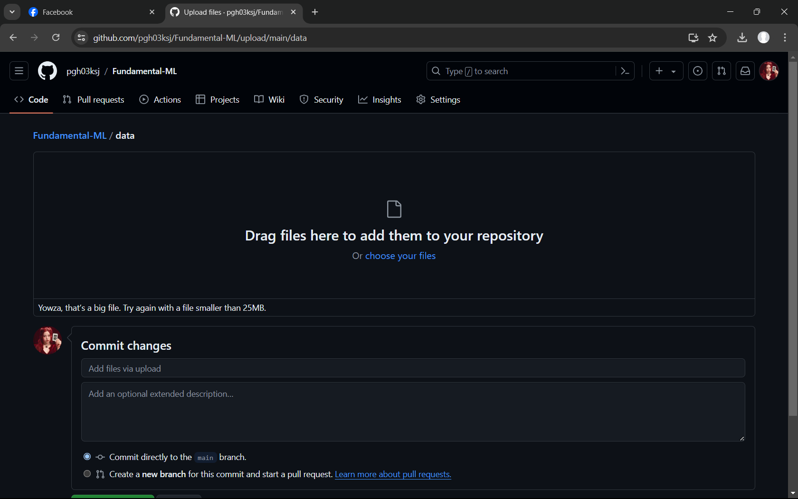

### Trong phần này có 5 nội dung chính :

I. Nhóm gồm 1 thành viên : 
    21110311 - Phạm Gia Hy

II. Một số vấn đề liên quan đến Github :
    Trong hình bên dưới, repo của em (fork từ repo của thầy) vẫn còn file ".gitignore". Em đặt       file dataset vào thư mục data như thầy hướng dẫn, nhưng vẫn bị báo "file quá lớn"

III. Nội dung liên quan đến project được đặt trong file readme.pdf bên cạnh file này.

IV. Em xin lỗi thầy vì không thể tìm được bạn bè để ghép nhóm. 
    Em không có bạn bè học chung hướng tin. 
    Em đã tự làm project này.

--------------------------------------------------------------------------------------------
Em cám ơn thầy.
